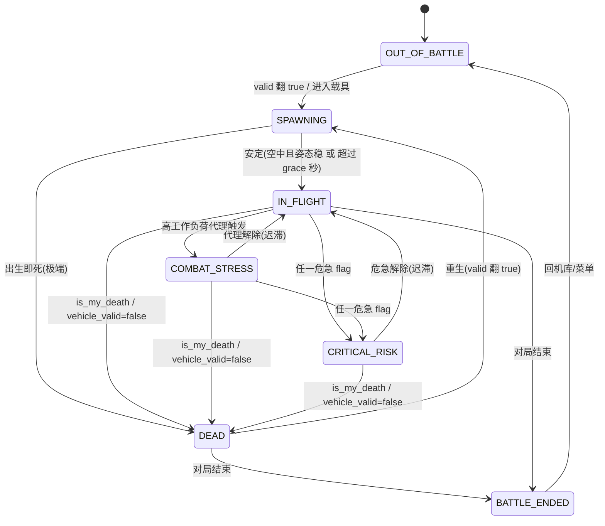

# D-B1｜Scenario 轻量 phase 模型（v1 · RB 空战）

> 状态：v0.2（汇合后）· 范围：v1 RB 空战，不碰 map，不做敌情感知，不做复杂 AI 战术判断
> 用途：定义一个**轻量、确定性、单态**的 phase 状态机，给 BattleEvent 与提示仲裁（D-B4）做**门控**
> 关联：D-B5 v0.2（事件→数据层来源）/ D-B2（BattleEvent 字典）/ D-B3（ConditionDetector）/ D-B4（仲裁）

## v0.2 边界更新（汇合后）

- 模型不变；唯一变化是**危急/重要提醒 flag 改由数据层 `/api/processed` 提供**（我们消费，不自己算阈值，见 D-B5 v0.2）。
- CRITICAL_RISK 危急集合 = 数据层 critical 级安全 flag 中我们的子集：`stall_critical`、`altitude_critical`、`overspeed_critical`。数据层 v1.6 已提供 `overspeed_critical`，插件侧已接入，仍需真机验证触发节奏和 Arbiter 抢占语义。
- COMBAT_STRESS 的"最近受创"信号取数据层 `hud_events`（关于我的 damage）。

## 0. 设计约束（先钉死边界）

- **Scenario 只做提示门控，不做战局理解。** 它的唯一职责是"在什么处境下，哪些事件该说/该压、用什么节奏"，不解释战局、不预测、不分类敌情。
- **确定性**：每个 Scenario 的进入/退出都由明确的字段阈值或离散信号决定，无概率、无 ML。
- **单态**：任一时刻有且仅有一个 Scenario（phase machine），用固定优先级解析。
- **数据来源**：仅数据层 `/api/telemetry` 中的 `state`、`indicators`、`processed.flags`、`combat.feed`、`hud_notices`、`mission_status` 等字段（与 D-B5 一致）。不碰 map。
- **Scenario ≠ Detector**：危险的"检测"在 D-B3 的 ConditionDetector 里；Scenario 只**消费**这些 flag 来切换处境。

## 1. Scenario 列表

| Scenario | 一句话 | v1 |
|---|---|---|
| `OUT_OF_BATTLE` | 不在对局（机库 / 菜单 / 加载） | 必须 |
| `SPAWNING` | 刚进场 / 刚重生的短暂安定期 | 必须 |
| `IN_FLIGHT` | 在战、存活、常规飞行（默认态） | 必须 |
| `COMBAT_STRESS` | 高工作负荷（最近受创 / 持续高 G）的代理态 | **v1 弱信号，见第 5 节** |
| `CRITICAL_RISK` | 任一危急安全 flag 激活（濒临失速 / 危险低空 / 严重超速） | 必须 |
| `DEAD` | 已阵亡，但对局仍在进行 | 必须 |
| `BATTLE_ENDED` | 本局结束（胜/负/撤离） | 必须 |

> 已评估、**不纳入 v1** 的候选：`RTB/LANDING`（降落）——可由 IN_FLIGHT + detector 上下文（低空+起落架）覆盖，单独成态收益低；`ENGAGED/敌情`——依赖 map，违反范围。

## 2. 状态机与转移

**每 tick 解析优先级（自上而下，命中即停，保证单态）**：

1. `OUT_OF_BATTLE`：未连接 8111，或 `/mission` 非进行中且非"刚结束"。
2. `BATTLE_ENDED`：`/mission` 状态为结束（win/fail/left）且尚未回到机库。
3. `DEAD`：在对局中但本机不存活（`/state.valid=false` 且对局进行中，或刚收到 `you_died`）。
4. `SPAWNING`：距上次"出生/重生"在 grace 窗口内。
5. `CRITICAL_RISK`：任一危急 flag 激活（v1 集合 = `stall_risk` / `low_alt_danger` / `overspeed`，来自 D-B3；**overheat 不在内**）。
6. `COMBAT_STRESS`：高工作负荷代理激活（见第 5 节）。
7. `IN_FLIGHT`：以上都不命中（在战、存活、常规）。

> 优先级即语义：危急永远盖过"打架"，"打架"盖过常规；阵亡/结束/离场盖过一切飞行态。

## 3. 逐 Scenario 定义

### OUT_OF_BATTLE
- 定义：不在任何对局中（机库、车库、菜单、加载、撤离后）。
- 进入：`/state.valid=false` 且 `/mission` 非进行中；或 8111 不可达；或从 `BATTLE_ENDED` 回到机库。
- 退出：`/state.valid` 翻 true / 进入载具 → `SPAWNING`。
- 依赖字段：`/state.valid`、`/mission.json` status、连接可用性。
- 对提示系统：**几乎静默**。压制所有飞行安全/战斗事件；仅放行非本插件的桌宠常态闲聊。

### SPAWNING
- 定义：刚进场/刚重生后的**短暂安定期**（grace window）。
- 进入：`/state.valid` false→true，或 `/indicators.type` 出现/变化（结合 `/mission` 进行中）。
- 退出：安定后 → `IN_FLIGHT`（判据：空中且姿态/速度稳定，或超过 grace 秒数，取先到）；极端情况出生即死 → `DEAD`。
- 依赖字段：`/state.valid` 跳变、`/indicators.type`、距出生时长、`/mission.json`。
- 对提示系统：放行**出生事件**（打招呼/就位）；**压制飞行安全**（避免刚出生在跑道/低速被误报低空/失速）；压制闲聊。这层 grace 是抑制假告警的关键。

### IN_FLIGHT
- 定义：在战、存活、常规飞行（默认态）。
- 进入：`SPAWNING` 安定、或 `CRITICAL_RISK`/`COMBAT_STRESS` 解除回落。
- 退出：危急 flag → `CRITICAL_RISK`；工作负荷代理 → `COMBAT_STRESS`；阵亡 → `DEAD`；对局结束 → `BATTLE_ENDED`。
- 依赖字段：`/state.valid=true`、存活判定。
- 对提示系统：**常规放行**——飞行安全（危急 + 重要提醒 + 一般提醒）、战斗击杀、陪伴闲聊都允许，按正常限流/冷却。

### COMBAT_STRESS（见第 5 节特别说明）
- 定义：**高工作负荷的纯物理代理态**，不代表"判定到了敌人"。
- 进入：最近 T 秒内收到**关于我的 hudmsg 受创**（被命中/起火等）**或**持续高 G 机动（`Ny` 超阈值持续若干秒）。
- 退出：代理条件解除并经迟滞（一段时间无受创且 G 回落）→ `IN_FLIGHT`。
- 依赖字段：`/hudmsg`（关于我的受创）、`/state.Ny`（G 载荷），可选 roll rate。
- 对提示系统：放行危急安全 + 重要提醒(overheat) + 战斗击杀（简短）；**压制一般提醒（如低油）与陪伴闲聊**，别在打架时分心。

### CRITICAL_RISK
- 定义：任一**危急**安全 flag 激活。**v1 危急集合 = `{stall_risk, low_alt_danger, overspeed}`**（濒临失速 / 危险低空 / 严重超速）。**overheat 不在此集合**——它归"安全·重要提醒"，不触发 CRITICAL_RISK、不抢占（见 D-B2）。
- 进入：D-B3 中属于危急集合的 detector 进入沿（signal = 数据层 critical 级 flag `stall_critical`/`altitude_critical`/`overspeed_critical`；`overspeed_critical` 已在数据层 v1.6 提供，插件侧待验证）。
- 退出：危急 flag 全部解除并经迟滞 → 回 `IN_FLIGHT`（或 `COMBAT_STRESS`，按优先级重算）。
- 依赖字段：由对应 detector 决定（`IAS/AoA/H/Vy/温度/...`），Scenario 本身只读 flag。
- 对提示系统：**只放行当前危急告警及其恢复**，并**抢占限流立即开口**；压制其它一切（含击杀、闲聊、低油）。

### DEAD
- 定义：本机已阵亡，但对局仍在进行（可能可重生或转观战）。
- 进入：收到 `combat.feed[].is_my_death == true` 的 `you_died`，或对局中本机 `vehicle_valid` 变为 false。后者只作为 Scenario 存活态判断，不再作为 `you_died` 事件主来源。
- 退出：重生（`valid` 翻 true）→ `SPAWNING`；对局结束 → `BATTLE_ENDED`。
- 依赖字段：`combat.feed[].is_my_death`、`state/vehicle.valid`、`mission_status`（确认仍在对局）。
- 对提示系统：放行**死亡安慰事件**；压制飞行安全（无意义）与战斗；安慰后可放行轻量闲聊。

### BATTLE_ENDED
- 定义：本局判定结束（胜/负/撤离）。
- 进入：`/mission.json` 状态为结束，或 `/hudmsg events[]` 含对局结束。
- 退出：回到机库/菜单 → `OUT_OF_BATTLE`。
- 依赖字段：`/mission.json` status、`/hudmsg events[]`。
- 对提示系统：放行**战斗结束小结**；压制飞行安全/战斗；可放行闲聊。

## 4. 事件允许 / 抑制矩阵（喂给 D-B4 仲裁）

事件类别：生命周期（出生/死亡/结束）· 安全·危急(stall/low_alt/overspeed，触发 CRITICAL_RISK + 可抢占) · 安全·重要提醒(overheat，不触发 CRITICAL_RISK、不抢占) · 安全·一般提醒(如低油) · 战斗·击杀 · 陪伴闲聊。

| Scenario | 生命周期 | 安全·危急 | 安全·重要提醒 | 安全·一般提醒 | 战斗·击杀 | 陪伴闲聊 |
|---|---|---|---|---|---|---|
| OUT_OF_BATTLE | — | 抑制 | 抑制 | 抑制 | 抑制 | 允许 |
| SPAWNING | 允许(出生) | 抑制(grace) | 抑制 | 抑制 | 抑制 | 抑制 |
| IN_FLIGHT | 允许 | 允许 | 允许 | 允许 | 允许 | 允许 |
| COMBAT_STRESS | 允许 | 允许 | 允许 | 抑制 | 允许(简短) | 抑制 |
| CRITICAL_RISK | 允许(死亡) | 允许(抢占) | 抑制 | 抑制 | 抑制 | 抑制 |
| DEAD | 允许(死亡) | 抑制 | 抑制 | 抑制 | 抑制 | 允许(安慰后) |
| BATTLE_ENDED | 允许(结束) | 抑制 | 抑制 | 抑制 | 抑制 | 允许 |

> 这张矩阵是 Scenario 对提示系统的**全部影响面**：仲裁器（D-B4）拿"当前 Scenario × 候选事件类别"查此表决定放行/抑制，再叠加限流/冷却/抢占。

## 5. COMBAT_STRESS 特别说明（v1 最大争议点）

**为什么它最弱**：其余 6 个 Scenario 都能由确定性事实（valid / mission / 时间 / 危急 flag）干净导出。但 COMBAT_STRESS 本质要回答"我是不是在交战"，而在 **不碰 map、不做敌情感知** 的约束下，8111 没有干净信号说明这一点——硬判就会滑向被明令禁止的"战局理解"。

**v1 的保守处理（本草稿采用）**：只用**自包含物理代理**，绝不推断敌情：
- 信号 A：最近 T 秒内有"关于我"的 hudmsg 受创（被命中/起火）。
- 信号 B：`Ny`（G 载荷）持续超阈值若干秒（剧烈机动）。
- 命中 A 或 B 即进入；都解除并迟滞后退出。

**已知局限**：信号 B 会把"特技/俯冲拉起"误判成交战（误判中等）；信号 A 滞后于交战开始。所以它只用于**降噪类门控**（压低油/闲聊），不驱动任何"开口"。

**备选方案（请你定夺）**：把 COMBAT_STRESS **从一等 Scenario 降级为仲裁器的一个 flag**（"最近受创窗口"），phase 机只保留 6 态。好处：phase 机更纯净、零误判风险；其"压制闲聊/低油"的门控价值用一个布尔窗口也能拿到。代价：少一个显式处境态。
- 推荐：**先按本草稿保留为 Scenario（保守代理）**；等合作者 D-A1 抓包回来，看 hudmsg 受创/高 G 的真实信噪比，再决定是否降级为 flag。

## 6. 与其它文档的衔接

- **CRITICAL_RISK / COMBAT_STRESS 依赖 D-B3 的 detector flag**：Scenario 不自己算危险，只读 flag。
- **第 4 节矩阵直接喂 D-B4 仲裁**：仲裁 = Scenario 门控 + 限流/冷却/抢占。
- **字段回填 D-A5**：本文用到的 `state/vehicle.valid`、`Ny`、`mission_status`、`combat.feed[].is_my_death`、`hud_notices`、`hud_events` 受创/结束等，须在 D-A5 确认稳定性；尤其 `mission_status` 的"结束/进行中"取值、`vehicle_valid` 翻转的多义性（死亡 vs 离场）需抓包实证。
- **未决项**：① grace 窗口秒数（待抓包定）；② COMBAT_STRESS 去留（第 5 节）；③ DEAD↔BATTLE_ENDED 的判据完全依赖 `/mission.json`，若该端点不稳需降级策略。
