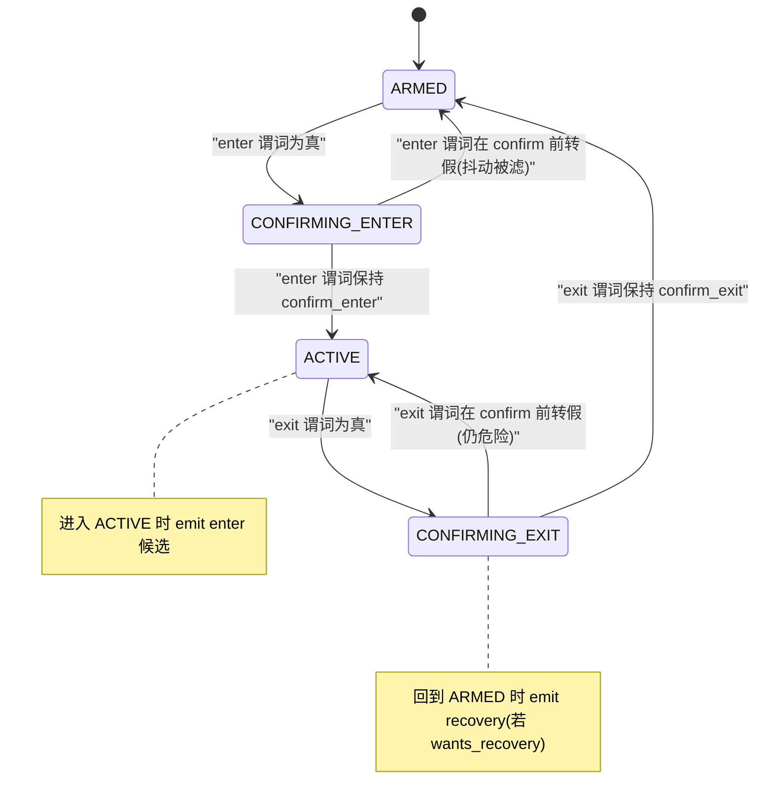

# D-B3｜ConditionDetector 规格（v1 · RB 空战）

> 状态：v0.2（汇合后）· 范围：v1 RB 空战
> 用途：定义"把连续/离散输入翻译成离散候选事件"的**统一检测单元**，从结构上杜绝 `state_evaluator` 变成 if/else 沼泽
> 关联：D-B5 v0.2（事件→数据层来源）/ D-B1（Scenario）/ D-B2（BattleEvent）/ D-B4（仲裁）

## v0.2 边界更新（汇合后）

数据层已自带逐机阈值告警 flags（`/api/processed`）。据此（已拍板）：

- **连续 Detector 的 `signal` 改为"读上游 flag"**：enter 谓词 = "数据层 flag 为真"、exit 谓词 = "flag 为假"，不再自己比阈值。第 4 节 FSM / debounce / 迟滞 / re-arm **完全不变**——它们仍由我们做（数据层 flag 是电平型、每帧出现、无防抖/边沿）。
- **v1 不再有"自己算原始阈值"的 Detector**：overspeed 已由数据层 v1.6 提供 flag、steep_dive 已删，所以所有连续 Detector 统一退化成"flag 边沿包装器"，**零混合**。
- 第 5 节两个家族仍成立：ConditionDetector（上游 flag → 边沿 FSM）/ DiscreteDetector（`hud_notices`/`combat.feed`/生命周期状态跳变 → 去重）。
- 逐机阈值 profile 归数据层 `vehicle_profiles`，**不在我们这层**。

### 数据源边沿语义分类（关键：数据层输出是混合的，按源消费，别一刀切）

把"连续数据 → 分立事件"是我们的核心任务，但**数据层有些输出已经是 fire-once 边沿事件**（合作者特别提醒：如敌机接近只在进入警戒距离时触发一次）。搞反会重复刷屏或漏报，故按源分类：

| 数据源 | 边沿语义 | 我们怎么消费 | v1 例 |
|---|---|---|---|
| `processed.flags` / `alerts` | **电平型**（每帧出现） | ConditionDetector：**我们**做边沿+debounce+迟滞+re-arm | stall/aoa/altitude/fuel/overheat/overspeed（数据层 v1.6 已给 flag，插件侧待验证） |
| `hud_notices` / `combat.feed` | **已边沿型**（带递增 id） | DiscreteDetector：**按 id 去重**，每个新 id 一次（fire-once） | overheat 技术通知 / you_killed / you_died |
| `proximity.events` | **已边沿型**（首次进入触发一次，带 id/kind） | DiscreteDetector：按 id 去重（合作者的例子，**v2**，v1 不消费） | 敌机接近 |
| `state` / `vehicle_type` / `mission_status` | **状态跳变型** | 检测跳变沿一次 | spawn / alive-state / battle_end |

> 一句话：**已边沿型（带 id）= 数据层已替我们 fire-once，我们只按 id 去重消费、绝不再 edge-detect；电平型 = fire-once 由我们的 re-arm 保证。**

## 0. 一句话定位

Detector = **一个纯粹的"条件 → 离散候选事件"单元**。它只回答"这个条件现在是不是（新）成立了"，不回答"要不要说、说哪条、说几次"。所有 Detector 长成同一种形状、放进一张注册表、由一个**通用引擎**统一驱动——**加一个场景 = 注册一条声明式配置，而不是在大函数里加一段 `if`**。这是本规格的全部目的。

## 1. 职责边界

**Detector 只做（唯一职责）**：
- 从 BattleState 取自己声明的信号；
- 判定 enter/exit（带 confirm + 迟滞）；
- 在**边沿**产出候选 BattleEvent（enter / 可选 recovery）；
- 维护自己那一点点 FSM 状态（armed/active）。

**Detector 绝不做（交给别人）**：
- ❌ Scenario 门控（"DEAD 里别报失速"）→ Arbiter（查 D-B1 矩阵）。
- ❌ 限流 / cooldown / 抢占 → Arbiter（见第 6 节）。
- ❌ 跨 Detector 去重（如多个危急安全事件同窗竞争）→ Arbiter。
- ❌ 拼提示文本 / 台词 → handler / 角色 LLM。
- ❌ `push_message` 或任何输出副作用。
- ❌ 读原始 8111 / 做单位归一 → 数据层（合作者）。
- ❌ 写 / 改 BattleState（只读消费）。
- ❌ 感知其它 Detector / Scenario / 猫娘的存在（零耦合）。
- ❌ 决定 severity / priority（这些是 D-B2 字典的属性，按 event_id 查，不在 Detector 里算）。

> 一句话纪律：**Detector 产出"候选"，不产出"决策"。** 任何"要不要/什么时候/对谁说"都不属于 Detector。

## 2. 输入

- **唯一输入 = BattleState 的只读视图**（当前帧派生标量 + 该 Detector 需要的短历史）。
- 每个 Detector **声明**自己需要的字段（对齐 D-B5 的"必须/推荐字段"），引擎据此从 BattleState 取值；缺字段时按 D-B5 的降级策略（粗判或不产出）。
- **不接触**：原始 8111、Scenario、其它 Detector 的状态、时钟以外的全局态。
- 需要趋势的 Detector（如低空靠 Vy、过热靠温度持续）从 BattleState 的**短历史环形缓冲**取，而不是自己存原始帧。

## 3. 输出

Detector 每 tick 产出 **0 或 1 个候选**，形状统一：

- `event_id`：对应 D-B2 字典里的事件（如 `stall_risk`）。
- `edge`：`enter` / `recovery`（recovery 仅当该事件配置 `wants_recovery=true`，v1 只给生死级）。
- `payload`：D-B2 声明的派生上下文标量（如 `ias_kmh/aoa_deg/...`）。
- `ts`：边沿发生时刻。

候选**不含** severity/priority/cooldown/scenario——那些由 Arbiter 按 `event_id` 查 D-B2/D-B1。Detector 另**暴露自身状态**（`armed`/`active`）供 Scenario 解析器读取（"危急集合里有 Detector active → CRITICAL_RISK"），但 Detector 自己不判 Scenario。

## 4. 连续 Detector 的状态机（enter/exit/confirm/hysteresis/re-arm 都在这里）

各概念落点：

- **enter / exit 条件**：声明为两个**谓词**（对信号视图的布尔表达），不是散落的 `if`。
- **迟滞（hysteresis）**：`exit` 谓词比 `enter` **更松**（如 enter: IAS<220；exit: IAS>260）。靠"两个不同谓词"天然实现，避免临界抖动。
- **debounce / confirm**：`confirm_enter` / `confirm_exit`（连续 N tick 或 T 秒）。谓词必须**持续保持**才翻状态——单帧尖刺（AoA/G）在 CONFIRMING 阶段被滤掉。
- **re-arm**：`ACTIVE → ARMED` 这条边就是 re-arm。**只有回到 ARMED 后，才可能再次 emit enter**。这保证"同一次持续危险"只发一次 enter，而不是每 tick 发。

## 5. 两个家族，一套协议（回答"连续与离散是否共用"）

**不共用同一套内部逻辑，但共用同一个 `Detector` 协议与输出契约**，因此能放进同一张注册表、被同一引擎驱动：

| | ConditionDetector（连续派生） | DiscreteDetector（combat.feed / hud_notices / 生命周期） |
|---|---|---|
| 输入 | BattleState 连续信号 + 短历史 | 离散事实（新 feed/notice id / 出生或存活态跳变 / mission 状态变化） |
| "边沿"来自 | 阈值 + confirm + 迟滞的 FSM（第 4 节） | **新事实的到达**（无阈值、无迟滞） |
| 去重靠 | re-arm（FSM ACTIVE→ARMED） | 游标/已见 id 集合（每个新 id 一次） |
| 例 | stall/overspeed/overheat/low_fuel/low_alt | overheat HUD notice / you_killed/you_died/spawn/battle_end |
| 共同点 | **同一输出契约**（event_id+edge+payload+ts）、同一注册接口、同样"只产候选不决策" | 同左 |

> 结论：**统一接口、统一注册表、统一引擎**；阈值 FSM 只是 ConditionDetector 这一家族的内部实现，不强加给离散事件。

## 6. cooldown 归 Detector 还是 Arbiter？

**cooldown 归 Arbiter，不归 Detector。** 区分两个极易混淆的概念：

| 概念 | 归属 | 语义 | 例 |
|---|---|---|---|
| **re-arm** | **Detector** | "这是不是一次**新的发生**" | 失速持续 5 秒只算一次，不是 50 次 |
| **cooldown** | **Arbiter** | "真实发生了两次，但**说得太频繁**要压一压" | 30 秒内第二次过热提醒压掉 |

理由：Detector 的职责是"世界是否（新）成立了某条件"——这是**事实**；"最近说过没、该不该再说"是**投递策略**，属于 Arbiter。把 cooldown 塞进 Detector 会重新把"检测"和"仲裁"焊死，正是评审要拆开的东西。所以：**Detector 在每个真实边沿都如实产候选；Arbiter 可能因 cooldown/限流/抢占/Scenario 把它丢掉。** 这样 Detector 保持纯粹、可单测（喂一段信号序列断言边沿）。

## 7. 注册表如何组织

- **DetectorRegistry** = 一组**声明式 Detector 描述符**。引擎每 tick：取 BattleState 视图 → 逐个喂给注册的 Detector → 收集候选 → 交给 Arbiter。引擎**对具体场景一无所知**（只跑协议）。
- 一个 Detector 描述符声明（纯配置，非代码逻辑）：
  - `id` / `event_id`（→ D-B2）
  - `kind`：`condition` / `discrete`
  - `required_fields` / `optional_fields`（→ D-B5；引擎据此做缺字段降级）
  - `signal`：从 BattleState 取哪些值（描述）
  - `enter` / `exit` 谓词、`confirm_enter` / `confirm_exit`（condition 家族）
  - `wants_recovery`：是否产 recovery 边沿（v1 仅生死级 true）
  - 阈值参数（草稿值，**待 D-A1 校准**；未来可做"逐机/逐模式阈值 profile"，仍是换配置不换逻辑）
- **加一个场景 = 往注册表加一条描述符**，零改引擎、零改其它 Detector。这就是防 if/else 沼泽的结构保证。

## 8. 防 if/else 的硬纪律（落到评审要求）

- 引擎里**没有** `if event_id == "stall": ...` 这种分支；引擎只认协议。
- Detector 之间**互不引用**；新增/删除一个不动其它。
- 差异化用**数据**表达（谓词 + 阈值 + confirm 配置），不用**控制流**表达。
- 逐机/逐模式差异 → 阈值 **profile**（配置层），**不是** Detector 内 `if vehicle == ...`。
- 任何"要不要说/说哪条/说几次/什么场景"出现在 Detector 里，即为越界（见第 1 节禁止清单）。

## 9. 衔接 + 开放项

- **上游**：Detector 读 D-A5 定型的 `TelemetrySnapshot` 派生出的 BattleState；字段缺失按 D-B5 降级。
- **下游**：候选交 D-B4 Arbiter，由它做 Scenario 门控（D-B1 矩阵）+ cooldown/限流/抢占（D-B2 属性）+ 跨事件去重。
- **Scenario 解析**：读危急集合 Detector 的 `active` 状态 → 决定 CRITICAL_RISK（D-B1）。
- 未决：① 各 Detector 的 enter/exit 阈值与 confirm 窗口（全部待 D-A1 抓包校准）；② 降级粗判（如无 AoA 的失速）是否单独成一个低置信 Detector；③ 阈值 profile 机制 v1 是否引入（建议 v1 先单套 RB 空战通用值，profile 留 v2）。
